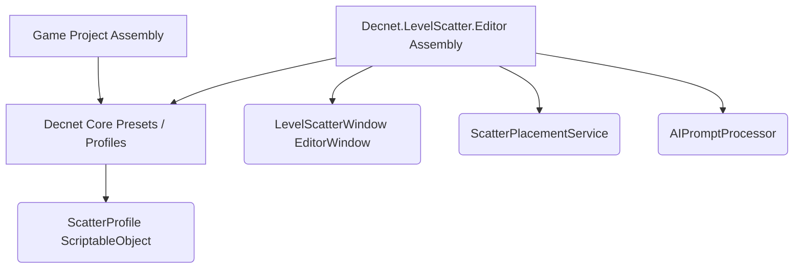
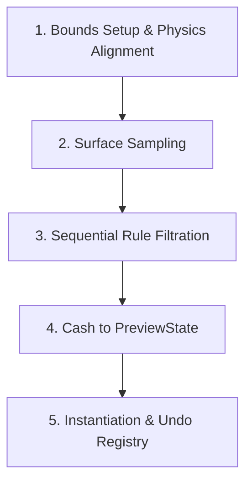

# Architecture Overview

This page details the technical architecture of AI Level Scatter, including execution lifecycles, editor assembly isolation, and algorithmic optimizations.

---

## 1. Assembly Isolation (`.asmdef`)

All level scattering code is contained within the `Editor` assembly. Since the tools are intended for edit-time environment setup, separating the code prevents editor-only dependencies (like `UnityEditor` APIs) from breaking standalone game builds.

---

## 2. Core Placement Lifecycle

When you click **Generate Preview** or **Apply**, the engine runs the following pipeline:

1. **Bounds Setup**: Centering bounds at surface selection and syncing PhysX database via `Physics.SyncTransforms()`.
2. **Surface Sampling**: SAMPLER queries terrain height or mesh collision points.
3. **Sequential Rule Filtration**: Loops through slope, height, spacing, and collision avoidance rules to evaluate candidates.
4. **Cache to PreviewState**: Caches valid candidates to `ScatterPreviewState` for SceneView drawing.
5. **Instantiation & Undo Registry**: Spawns instances, parenting them under `[Scatter]`, and registers operations with Unity's `Undo`.

---

## 3. Algorithmic Optimization: O(N) Spatial Hashing

A naive spacing filter check compares every candidate point against every other candidate, resulting in $O(N^2)$ complexity. For a density of 5,000 points, this requires up to 25 million distance calculations, freezing the editor.

**AI Level Scatter** utilizes a **Spatial Hash Grid** to reduce this to $O(N)$ complexity:
1. The bounding area is divided into virtual grid cells of size `minSpacing`.
2. As candidates are accepted, their coordinates are mapped to a 2D integer key `(cellX, cellZ)` and stored in a hash dictionary.
3. When evaluating a new candidate, the engine only queries the 9 neighboring cells (North, South, East, West, and diagonals) in the dictionary.
4. This keeps the distance calculations flat and near-instantaneous even at high densities.

---

## 4. Asynchronous Non-Blocking REST Client

To query LLMs without freezing the Unity Editor, the prompt processor utilizes Unity's event-driven `EditorApplication.update` loop:
- Network requests are sent via asynchronous `UnityWebRequest` calls.
- Instead of using a blocking `System.Threading.Thread.Sleep` loop, the `AIPromptProcessor` registers a callback listener on the editor's main update ticks.
- Once the socket completes, the callback executes on the main thread, parsing JSON results securely and regenerating presets.
